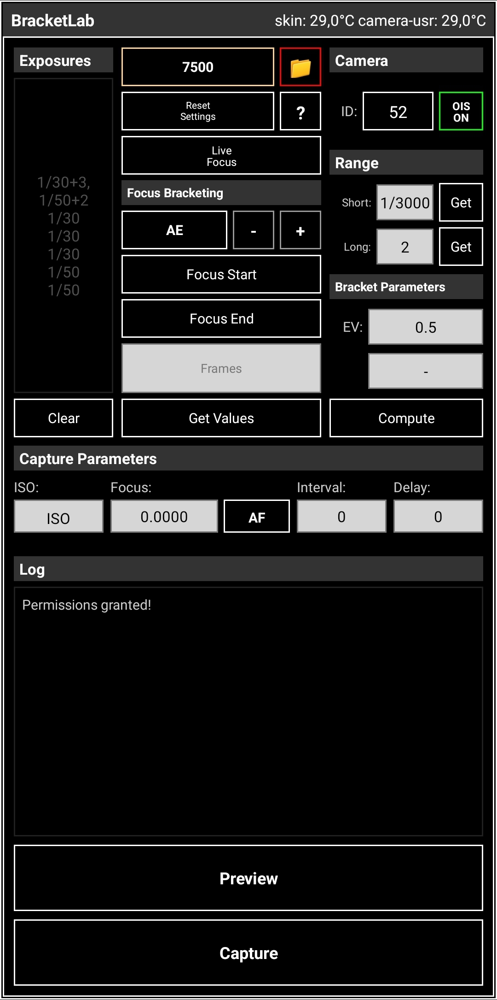

# BracketLab

<p align="center">
  
</p>

BracketLab is an Android Camera2 app for capturing controlled RAW/DNG exposure and focus brackets. It is designed for tripod-based HDR, stacking, long exposure sets, and repeatable manual capture workflows where stable exposure, focus, white balance, and camera module selection matter more than point-and-shoot automation.

The app captures one RAW frame at a time with explicit Camera2 requests, writes DNG files, and provides helper tools for exposure metering, autofocus locking, live manual focus, preview inspection, focus bracketing, and thermal monitoring.

## Features

- RAW/DNG capture through Camera2 and `DngCreator`.
- Custom exposure lists using values such as `1/500`, `1/30`, `0.5`, `1`, or `10`.
- Exposure shorthand expansion, for example `1/30+3` becomes three `1/30` frames.
- HDR bracket computation from short exposure, long exposure, and EV spacing.
- Manual ISO, exposure time, focus distance, white balance, and OIS control.
- AE metering helper with +/- 0.5 EV bias before writing measured values to the UI.
- AF lock helper that measures focus once and holds the value for capture.
- Live focus preview with zoom and focus slider for manual focus adjustment.
- Focus bracketing between start and end focus distances.
- RAW-capable camera selector, including probing for vendor-hidden RAW camera IDs.
- Preview overlay with exposure compensation and zoom controls.
- Thermal status display for `skin` and `camera-usr` sensors when exposed by the device.
- Optional per-sequence folder mode for cleaner DNG organization.

## Requirements

- Android 5.0+ (API 21 minimum).
- A device camera with `RAW_SENSOR` support.
- Android Studio Hedgehog or newer.
- JDK 17.
- Android SDK / compile SDK 34.

The project uses:

- Gradle 8.12 through the Gradle Wrapper.
- Android Gradle Plugin 8.2.2.
- Kotlin Android plugin 1.9.22.
- AndroidX Core, AppCompat, and Material Components.

## Build

Open the project in Android Studio and let Gradle sync normally.

For command-line builds, make sure Android SDK is available through Android Studio, `ANDROID_HOME`, or a local `local.properties` file:

```properties
sdk.dir=C:/Users/your-user/AppData/Local/Android/Sdk
```

Then run:

```bash
# Windows
gradlew.bat assembleDebug

# macOS/Linux
./gradlew assembleDebug
```

The debug APK is generated under:

```text
app/build/outputs/apk/debug/
```

## Basic Workflow

1. Mount the phone on a tripod.
2. Select the Camera ID first.
3. Confirm WB, OIS, ISO, focus, exposure list, interval, and delay.
4. Use Preview, AE, AF, Live Focus, or Compute as setup tools.
5. Start Capture only after the camera module and capture values are final.
6. Import the resulting DNG files into Lightroom, Darktable, RawTherapee, Photoshop, or another RAW/HDR workflow.

For tripod stacking, keep OIS off when possible. Optical stabilization can introduce tiny frame shifts even when the phone is physically stable.

## Exposure Input

The Exposures field accepts one exposure per line:

```text
1/500
1/250
1/100
1/30
1
2
5
10
```

You can also use shorthand:

```text
1/30+3
1/50+2
```

Expanded result:

```text
1/30
1/30
1/30
1/50
1/50
```

## HDR Bracket Compute

The Range section can generate an exposure list automatically:

- Short: shortest exposure used to protect highlights.
- Long: longest exposure used to recover shadows.
- EV: spacing between generated frames.

Lower EV spacing creates smoother brackets with more frames. Higher EV spacing creates fewer frames and lighter capture sets.

## Focus Tools

AF runs autofocus once, reads the resulting lens distance, and holds focus so the lens does not refocus during capture.

Live Focus opens a zoomed preview with a focus slider. Releasing the slider writes the selected focus value into the target focus field.

Focus Bracketing generates evenly spaced focus values between Focus Start and Focus End. This is useful when the subject depth requires later focus stacking.

## Output Files

DNG files are saved through MediaStore on Android 10+ and to public DCIM storage on older Android versions.

Default folder:

```text
DCIM/BracketLab/
```

With folder mode enabled, each sequence is saved under:

```text
DCIM/BracketLab/yyyyMMdd_HH_mm_ss/
```

Filename format:

```text
S01_F03_E30_I400.dng
```

Where:

- `S01` is the sequence number.
- `F03` is the frame number.
- `E30` means `1/30s`.
- `E2s` means `2s`.
- `I400` is ISO 400.

When folder mode is disabled, filenames also include a time prefix to reduce name collisions.

## Device Compatibility

RAW support varies by device and by camera module. Some phones expose RAW only on specific rear cameras, while others hide additional RAW-capable modules behind vendor camera IDs. BracketLab lists normal Camera2 IDs and probes additional IDs to find hidden RAW-capable modules when available.

If a camera does not expose RAW output sizes or `RAW_SENSOR` capability, it is skipped or rejected for capture.

## Repository Notes

The repository intentionally excludes generated and local machine files such as:

- `build/`
- `app/build/`
- `.gradle/`
- `.idea/`
- `local.properties`
- local Android SDK folders
- downloaded Gradle ZIPs

Use the Gradle Wrapper files in the repository instead of committing a local Gradle installation or Android SDK.

## License

This project is licensed under the MIT License. See [LICENSE](LICENSE) for details.
